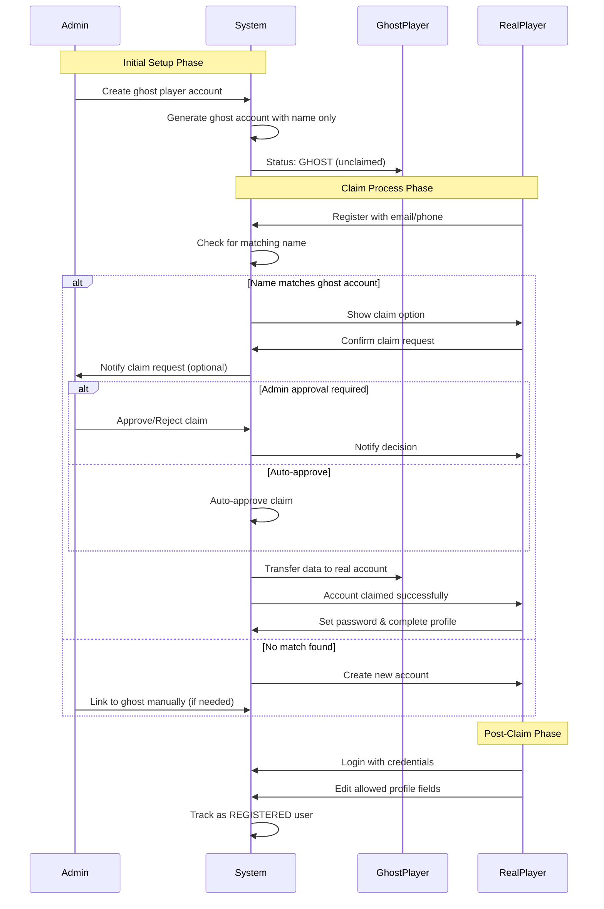

# Ghost Player Claim Workflow

## Overview
The claim workflow allows real players to take ownership of ghost accounts created by admins.

## Workflow Diagram

## Claim Process Options

### Option 1: Auto-Claim (Recommended)
- Player registers with matching name
- System automatically suggests claim
- No admin approval needed
- Fastest user experience

### Option 2: Admin Approval
- Player requests claim
- Admin reviews and approves
- More control but slower

### Option 3: Claim Code
- Admin generates unique claim code
- Share code with player offline
- Player uses code to claim account
- Most secure but requires coordination

## Implementation Steps

1. **Ghost Account Creation**
   - Admin creates player with minimal info
   - System marks as `userType: 'GHOST'`
   - No password set initially

2. **Registration Flow**
   - New user registers
   - System checks name similarity
   - Offer claim if match found

3. **Claim Validation**
   - Verify unclaimed status
   - Transfer historical data
   - Update user type to 'REGISTERED'

4. **Profile Completion**
   - Set password
   - Add contact info
   - Upload avatar
   - Select position details