# Football Club Management System - Database E-R Diagram

## Entity Relationship Diagram

```mermaid
erDiagram
    USERS {
        uuid id PK
        string name "Player name"
        string email "Optional, for claimed accounts"
        string phone "Optional, for claimed accounts"
        string password_hash "For claimed accounts only"
        enum user_type "ADMIN, PLAYER"
        enum account_status "GHOST, CLAIMED"
        int jersey_number "Optional"
        enum position "GK, DF, MF, FW"
        enum dominant_foot "LEFT, RIGHT, BOTH"
        string avatar_url "Profile picture"
        text introduction "Player bio"
        date join_date
        timestamp created_at
        timestamp updated_at
        uuid created_by FK "Admin who created this user"
    }

    MATCHES {
        uuid id PK
        date match_date
        time match_time
        string opponent_team
        int our_score
        int opponent_score
        enum match_result "WIN, LOSE, DRAW"
        decimal field_fee_total "Total field cost"
        decimal water_fee_total "Water and facility costs"
        decimal fee_coefficient "Cost per time unit"
        text notes "Additional match notes"
        timestamp created_at
        timestamp updated_at
        uuid created_by FK "Admin who created match"
    }

    MATCH_PARTICIPATIONS {
        uuid id PK
        uuid user_id FK
        uuid match_id FK
        
        %% Attendance tracking (3 sections × 3 parts)
        decimal section1_part1 "0, 0.5, or 1"
        decimal section1_part2 "0, 0.5, or 1"
        decimal section1_part3 "0, 0.5, or 1"
        decimal section2_part1 "0, 0.5, or 1"
        decimal section2_part2 "0, 0.5, or 1"
        decimal section2_part3 "0, 0.5, or 1"
        decimal section3_part1 "0, 0.5, or 1"
        decimal section3_part2 "0, 0.5, or 1"
        decimal section3_part3 "0, 0.5, or 1"
        
        %% Special roles
        boolean is_goalkeeper "Goalkeeper doesn't pay field fee"
        
        %% Calculated fields (for reference)
        decimal total_time "Sum of all attendance"
        decimal field_fee_calculated "Based on attendance time"
        boolean is_late "Late arrival flag"
        decimal late_fee "10 yuan if late"
        decimal video_fee "Video recording fee"
        decimal total_fee_calculated "Reference total"
        
        %% Payment proxy
        string payment_proxy "Who paid for this player"
        text notes "Additional notes"
        
        timestamp created_at
        timestamp updated_at
    }

    MATCH_EVENTS {
        uuid id PK
        uuid match_id FK
        uuid player_id FK "Player who performed the action"
        enum event_type "GOAL, ASSIST, YELLOW_CARD, RED_CARD, PENALTY_GOAL, OWN_GOAL, SAVE"
        int minute "Match minute when event occurred"
        text description "Event description"
        timestamp created_at
        uuid created_by FK "Admin who recorded event"
    }

    VIDEOS {
        uuid id PK
        uuid match_id FK
        string title "Video title"
        text description "Video description"
        enum storage_type "LOCAL, S3"
        string file_path "Local path or S3 key"
        string s3_bucket "S3 bucket name if using S3"
        string s3_region "S3 region if using S3"
        string cdn_url "CloudFront URL if using CDN"
        bigint file_size "File size in bytes"
        int duration_seconds "Video duration"
        string thumbnail_url "Video thumbnail"
        timestamp created_at
        uuid created_by FK "Admin who uploaded video"
    }

    COMMENTS {
        uuid id PK
        uuid match_id FK
        uuid user_id FK "Comment author"
        uuid parent_comment_id FK "For threaded replies"
        text content "Comment text"
        json images "Array of image URLs/paths"
        boolean is_edited "Track if comment was edited"
        timestamp created_at
        timestamp updated_at
        timestamp deleted_at "Soft delete"
    }

    AUDIT_LOGS {
        uuid id PK
        uuid user_id FK "User who performed action"
        string table_name "Affected table"
        uuid record_id "Affected record ID"
        enum action_type "CREATE, UPDATE, DELETE"
        json old_values "Previous values"
        json new_values "New values"
        string ip_address "User IP"
        string user_agent "Browser info"
        timestamp created_at
    }

    SYSTEM_CONFIG {
        string key PK "Configuration key"
        string value "Configuration value"
        text description "What this config does"
        timestamp updated_at
        uuid updated_by FK "Admin who updated config"
    }

    %% Relationships
    USERS ||--o{ MATCH_PARTICIPATIONS : "participates"
    MATCHES ||--o{ MATCH_PARTICIPATIONS : "has_participants"
    MATCHES ||--o{ MATCH_EVENTS : "has_events"
    USERS ||--o{ MATCH_EVENTS : "performs"
    MATCHES ||--o{ VIDEOS : "has_videos"
    MATCHES ||--o{ COMMENTS : "has_comments"
    USERS ||--o{ COMMENTS : "writes"
    COMMENTS ||--o{ COMMENTS : "replies_to"
    USERS ||--o{ AUDIT_LOGS : "performs_action"
    USERS ||--o{ USERS : "created_by"
    USERS ||--o{ SYSTEM_CONFIG : "updates_config"
```



## Key Design Decisions

### 1. User Management
- **Ghost Accounts**: `account_status = 'GHOST'` for admin-created players
- **Account Claiming**: Admin manually links ghost accounts to real registrations
- **Flexible Auth**: Email/phone optional for ghost accounts

### 2. Match Participation Tracking
- **Granular Attendance**: 9 separate fields for 3 sections × 3 parts
- **Goalkeeper Handling**: Special flag to exclude from field fees
- **Financial Reference**: Calculated fees stored for reference only

### 3. Event Tracking
- **Flexible Events**: Covers goals, assists, cards, penalties, own goals
- **Attribution**: Links events to specific players
- **Timing**: Records match minute for detailed analysis

### 4. Video Storage
- **Configurable Storage**: Supports both local and S3 storage
- **CDN Support**: CloudFront integration for S3-hosted videos
- **Metadata**: Duration, size, thumbnail support

### 5. Comment System
- **Rich Content**: Text + multiple images
- **Threading**: Nested replies via `parent_comment_id`
- **Soft Delete**: Maintains comment history

### 6. Audit Trail
- **Comprehensive Logging**: All CRUD operations tracked
- **Change History**: Before/after values in JSON
- **User Attribution**: Links changes to specific users

### 7. Statistics Calculation
- **On-Demand**: No cached statistics tables
- **Year-Based**: Filter by match_date for seasonal data
- **Cross-Year**: Aggregate across all seasons for career stats

## Sample Queries

### Season Statistics
```sql
-- Player goals in 2024
SELECT u.name, COUNT(me.id) as goals
FROM users u
JOIN match_participations mp ON u.id = mp.user_id
JOIN matches m ON mp.match_id = m.id
JOIN match_events me ON u.id = me.player_id 
WHERE me.event_type = 'GOAL' 
  AND EXTRACT(YEAR FROM m.match_date) = 2024
GROUP BY u.id, u.name
ORDER BY goals DESC;
```

### Team Performance
```sql
-- Team record for 2024
SELECT 
  COUNT(*) as total_matches,
  SUM(CASE WHEN match_result = 'WIN' THEN 1 ELSE 0 END) as wins,
  SUM(CASE WHEN match_result = 'LOSE' THEN 1 ELSE 0 END) as losses,
  SUM(CASE WHEN match_result = 'DRAW' THEN 1 ELSE 0 END) as draws
FROM matches 
WHERE EXTRACT(YEAR FROM match_date) = 2024;
```

### Financial Summary
```sql
-- Monthly financial summary
SELECT 
  EXTRACT(MONTH FROM m.match_date) as month,
  SUM(mp.total_fee_calculated) as total_fees,
  SUM(m.field_fee_total + m.water_fee_total) as total_costs
FROM matches m
JOIN match_participations mp ON m.id = mp.match_id
WHERE EXTRACT(YEAR FROM m.match_date) = 2024
GROUP BY EXTRACT(MONTH FROM m.match_date)
ORDER BY month;
```

## Next Steps
1. Review and approve E-R design
2. Update Prisma schema based on this design
3. Create migration scripts
4. Update API endpoints
5. Modify frontend components to use new data structure