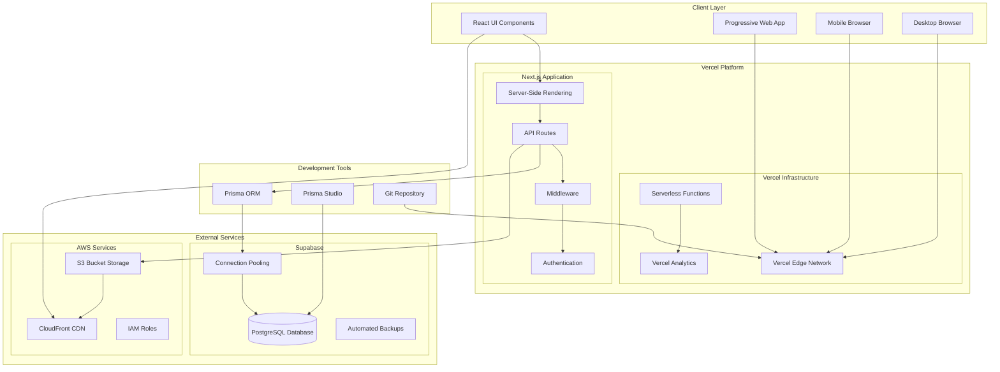

# Football Club Management System - System Architecture Design

## 1. Executive Summary

This document outlines the comprehensive system architecture for the Football Club Management System, a Next.js 14 full-stack application deployed on Vercel with Supabase database and AWS S3 for file storage. The system is designed to handle ~30 active users with weekly match frequency while maintaining high performance and scalability.

## 2. System Overview

### 2.1 Architecture Pattern
- **Pattern**: Serverless Full-Stack Architecture
- **Frontend**: Next.js 14 with App Router (React 18+)
- **Backend**: Next.js API Routes (Serverless Functions)
- **Database**: PostgreSQL on Supabase
- **File Storage**: AWS S3 + CloudFront CDN
- **Deployment**: Vercel (Frontend + API), Supabase (Database), AWS (Storage)

### 2.2 Technology Stack

#### Frontend Stack
```
- Framework: Next.js 14 (App Router)
- Language: TypeScript
- Styling: CSS Modules + Tailwind CSS
- State Management: React Context + useState/useReducer
- Form Handling: React Hook Form
- Date Handling: date-fns
- UI Components: Custom components + react-select
- Icons: Custom SVG icons
```

#### Backend Stack
```
- Runtime: Node.js 18+ (Vercel Functions)
- API: Next.js API Routes (App Router)
- ORM: Prisma with PostgreSQL
- Authentication: NextAuth.js (future implementation)
- File Upload: Multer + AWS SDK v3
- Validation: Zod schemas
- Error Handling: Custom error middleware
```

#### Database & Storage
```
- Database: PostgreSQL 15+ (Supabase)
- Connection Pooling: PgBouncer (Supabase built-in)
- File Storage: AWS S3
- CDN: AWS CloudFront
- Backup: Supabase automated backups
```

#### DevOps & Monitoring
```
- Deployment: Vercel (Git-based)
- Environment Management: Vercel Environment Variables
- Monitoring: Vercel Analytics + Custom logging
- Error Tracking: Built-in error boundaries
- Database Monitoring: Supabase Dashboard
```

## 3. System Architecture Diagram



## 4. Data Architecture

### 4.1 Database Design
- **Primary Database**: PostgreSQL on Supabase
- **Connection Strategy**: Connection pooling via PgBouncer
- **Data Modeling**: Relational model with foreign keys
- **Indexing Strategy**: Optimized for common query patterns

#### Key Indexes
```sql
-- Performance-critical indexes
CREATE INDEX idx_matches_date ON matches(match_date);
CREATE INDEX idx_match_events_match_player ON match_events(match_id, player_id);
CREATE INDEX idx_participations_user_match ON match_participations(user_id, match_id);
CREATE INDEX idx_comments_match_parent ON comments(match_id, parent_comment_id);
CREATE INDEX idx_audit_logs_table_record ON audit_logs(table_name, record_id);
```

### 4.2 File Storage Architecture
```
AWS S3 Structure:
football-club-app/
├── videos/
│   ├── matches/
│   │   └── {match-id}/
│   │       ├── full-match.mp4
│   │       └── highlights.mp4
│   └── thumbnails/
│       └── {video-id}.jpg
├── images/
│   ├── avatars/
│   │   └── {user-id}/
│   └── comments/
│       └── {comment-id}/
└── exports/
    └── excel/
        └── {timestamp}-match-data.xlsx
```

## 5. API Architecture

### 5.1 API Route Structure
```
/api/
├── auth/
│   ├── login/
│   ├── register/
│   └── claim-account/
├── users/
│   ├── route.ts          # GET, POST
│   ├── [id]/
│   │   ├── route.ts      # GET, PUT, DELETE
│   │   └── claim/
│   └── ghost/
├── matches/
│   ├── route.ts          # GET, POST
│   ├── [id]/
│   │   ├── route.ts      # GET, PUT, DELETE
│   │   ├── participations/
│   │   ├── events/
│   │   └── comments/
│   └── excel-import/
├── statistics/
│   ├── leaderboards/
│   ├── season/
│   └── career/
├── videos/
│   ├── upload/
│   ├── [id]/
│   └── stream/
└── admin/
    ├── audit-logs/
    ├── system-config/
    └── reports/
```

### 5.2 API Response Format
```typescript
// Standard API Response
interface ApiResponse<T> {
  success: boolean;
  data?: T;
  error?: {
    code: string;
    message: string;
    details?: any;
  };
  pagination?: {
    page: number;
    limit: number;
    total: number;
    totalPages: number;
  };
}

// Error Response
interface ErrorResponse {
  success: false;
  error: {
    code: "VALIDATION_ERROR" | "NOT_FOUND" | "UNAUTHORIZED" | "SERVER_ERROR";
    message: string;
    details?: Record<string, any>;
  };
}
```

## 6. Security Architecture

### 6.1 Authentication & Authorization
```typescript
// Authentication Flow
1. User Registration → Email/Phone verification
2. Account Claiming → Admin approval workflow
3. Session Management → JWT tokens (httpOnly cookies)
4. Role-based Access → ADMIN | PLAYER permissions

// Authorization Matrix
Resource         | Guest | Player | Admin
-----------------|-------|--------|-------
View Matches     |   ✓   |   ✓    |   ✓
View Statistics  |   ✓   |   ✓    |   ✓
Create Comments  |   ✗   |   ✓    |   ✓
Edit Own Profile |   ✗   |   ✓    |   ✓
Manage Matches   |   ✗   |   ✗    |   ✓
Admin Panel      |   ✗   |   ✗    |   ✓
```

### 6.2 Data Security
- **Input Validation**: Zod schemas for all API inputs
- **SQL Injection Prevention**: Prisma ORM with parameterized queries
- **File Upload Security**: Type validation, size limits, virus scanning
- **CORS Policy**: Restricted to application domains
- **Rate Limiting**: API route protection against abuse

### 6.3 Environment Security
```typescript
// Environment Variables
interface EnvironmentConfig {
  // Database
  DATABASE_URL: string;
  DIRECT_URL: string;
  
  // AWS
  AWS_ACCESS_KEY_ID: string;
  AWS_SECRET_ACCESS_KEY: string;
  AWS_S3_BUCKET: string;
  AWS_S3_REGION: string;
  CLOUDFRONT_DOMAIN: string;
  
  // Application
  NEXTAUTH_SECRET: string;
  NEXTAUTH_URL: string;
  
  // Feature Flags
  ENABLE_FILE_UPLOAD: boolean;
  ENABLE_VIDEO_STREAMING: boolean;
}
```

## 7. Performance Optimization

### 7.1 Frontend Performance
```typescript
// Optimization Strategies
1. Code Splitting → Dynamic imports for heavy components
2. Image Optimization → Next.js Image component with WebP
3. Caching Strategy → Static generation for leaderboards
4. Bundle Optimization → Tree shaking, minification
5. Critical CSS → Inline critical styles
6. Prefetching → Link prefetching for navigation

// Performance Targets
- First Contentful Paint: < 1.5s
- Largest Contentful Paint: < 2.5s
- Cumulative Layout Shift: < 0.1
- First Input Delay: < 100ms
```

### 7.2 Backend Performance
```typescript
// Database Optimization
1. Connection Pooling → PgBouncer configuration
2. Query Optimization → Efficient joins and indexes
3. Caching Strategy → API route caching headers
4. Batch Operations → Bulk inserts for Excel imports
5. Pagination → Limit result sets

// API Performance Targets
- API Response Time: < 500ms (p95)
- Database Query Time: < 100ms (p95)
- File Upload Time: < 5s for 100MB
- Statistics Calculation: < 1s
```

### 7.3 Caching Strategy
```typescript
// Multi-layer Caching
1. Browser Cache → Static assets (1 year)
2. CDN Cache → API responses (5 minutes)
3. Application Cache → Statistics queries (1 hour)
4. Database Cache → Query result caching

// Cache Invalidation
- Match data updates → Clear related statistics
- User profile changes → Clear user-specific caches
- Video uploads → Clear match video lists
```

## 8. Scalability Design

### 8.1 Horizontal Scaling
```typescript
// Serverless Scaling
- Vercel Functions → Auto-scaling based on demand
- Database Connections → Pooled connections
- File Storage → S3 unlimited storage
- CDN → Global edge distribution

// Capacity Planning
Current: 30 users, 50 matches/year
Target: 100 users, 200 matches/year
Peak Load: 50 concurrent users
```

### 8.2 Vertical Scaling
```typescript
// Resource Allocation
- Function Memory → 1GB (default), 3GB (video processing)
- Function Timeout → 10s (API), 60s (file upload)
- Database → Supabase Pro plan (8GB RAM, 120GB storage)
- File Storage → S3 Standard (unlimited)
```

## 9. Environment Management

### 9.1 Development Environment
```typescript
// Local Development Stack
- Runtime: Node.js 18+
- Database: Local PostgreSQL or Supabase Dev
- File Storage: Local filesystem (development)
- Hot Reload: Next.js Fast Refresh
- Code Quality: ESLint, Prettier, TypeScript

// Development Workflow
1. Feature Development → Local environment
2. Code Review → GitHub Pull Request
3. Testing → Unit tests + Integration tests
4. Staging → Preview deployment on Vercel
5. Production → Main branch deployment
```

### 9.2 Staging Environment
```typescript
// Staging Configuration
- Database: Supabase staging instance
- File Storage: S3 staging bucket
- Domain: staging.football-club.app
- Data: Synthetic test data
- Features: Feature flags for testing

// Staging Purpose
- End-to-end testing
- Performance testing
- User acceptance testing
- Integration validation
```

### 9.3 Production Environment
```typescript
// Production Configuration
- Database: Supabase production instance
- File Storage: S3 production bucket
- Domain: football-club.app
- Monitoring: Full observability stack
- Backup: Automated daily backups

// Production Safeguards
- Database migrations → Reversible migrations
- Feature flags → Gradual rollouts
- Error monitoring → Real-time alerts
- Performance monitoring → SLA tracking
```

## 10. Deployment Architecture

### 10.1 CI/CD Pipeline
```yaml
# GitHub Actions Workflow
name: Deploy
on:
  push:
    branches: [main, develop]

jobs:
  test:
    runs-on: ubuntu-latest
    steps:
      - Checkout code
      - Setup Node.js
      - Install dependencies
      - Run tests
      - Type check
      - Lint code

  deploy:
    needs: test
    runs-on: ubuntu-latest
    steps:
      - Deploy to Vercel
      - Update database schema
      - Invalidate CDN cache
      - Run smoke tests
```

### 10.2 Infrastructure as Code
```typescript
// Vercel Configuration
{
  "builds": [
    { "src": "package.json", "use": "@vercel/next" }
  ],
  "functions": {
    "app/api/**": {
      "maxDuration": 60
    }
  },
  "env": {
    "NODE_ENV": "production"
  }
}

// AWS Resources
- S3 Bucket: football-club-storage
- CloudFront Distribution: Global CDN
- IAM Role: Limited S3 access
- Lambda@Edge: Image optimization
```

## 11. Monitoring & Observability

### 11.1 Application Monitoring
```typescript
// Monitoring Stack
1. Performance → Vercel Analytics
2. Errors → Custom error boundaries + logging
3. API Metrics → Response times, error rates
4. User Analytics → Page views, user flows
5. Database → Supabase dashboard metrics

// Alert Conditions
- API Error Rate > 5%
- Response Time > 2s (p95)
- Database CPU > 80%
- S3 Upload Failures > 10%
```

### 11.2 Logging Strategy
```typescript
// Log Levels
interface LogEntry {
  timestamp: string;
  level: "ERROR" | "WARN" | "INFO" | "DEBUG";
  message: string;
  context: {
    userId?: string;
    matchId?: string;
    operation: string;
    duration?: number;
  };
  metadata?: Record<string, any>;
}

// Log Destinations
- Application Logs → Vercel Functions logs
- Audit Logs → Database (audit_logs table)
- Error Logs → Custom error tracking
- Performance Logs → Vercel Analytics
```

## 12. Disaster Recovery & Backup

### 12.1 Backup Strategy
```typescript
// Automated Backups
1. Database → Supabase daily backups (30-day retention)
2. Files → S3 versioning + lifecycle policies
3. Code → Git repository with multiple remotes
4. Configuration → Environment variable backups

// Recovery Procedures
- Database Recovery → Point-in-time restore (Supabase)
- File Recovery → S3 version restoration
- Application Recovery → Git rollback + redeploy
- Configuration Recovery → Environment restore
```

### 12.2 Business Continuity
```typescript
// Service Dependencies
Primary: Vercel + Supabase + AWS
Fallback: Local deployment + self-hosted DB
Emergency: Read-only mode with cached data

// RTO/RPO Targets
- Recovery Time Objective: 4 hours
- Recovery Point Objective: 1 hour
- Maximum Downtime: 8 hours/year
```

## 13. Cost Management

### 13.1 Cost Structure
```typescript
// Monthly Cost Estimate (Production)
- Vercel Pro: $20/month
- Supabase Pro: $25/month  
- AWS S3 + CloudFront: $10-50/month (depending on video usage)
- Domain: $12/year
- Total: ~$55-95/month

// Cost Optimization
- S3 Intelligent Tiering → Automatic cost optimization
- CloudFront Caching → Reduce origin requests
- Database Connection Pooling → Efficient resource usage
- Vercel Edge Functions → Faster, cheaper execution
```

### 13.2 Scaling Costs
```typescript
// Cost per User (estimated)
- Storage: $0.50/user/month (videos + images)
- Database: $0.25/user/month
- Compute: $0.10/user/month
- CDN: $0.15/user/month
- Total: ~$1.00/user/month

// Break-even Analysis
- Current: 30 users = $30/month
- Target: 100 users = $100/month
- Enterprise: 500+ users = custom pricing
```

## 14. Security Compliance

### 14.1 Data Protection
```typescript
// GDPR Compliance
- Data Minimization → Collect only necessary data
- Right to Access → User data export API
- Right to Deletion → Soft delete with purge
- Data Portability → JSON export format
- Consent Management → Explicit user consent

// Data Retention
- User Data → Indefinite (with deletion option)
- Audit Logs → 7 years
- Video Files → 2 years
- Temporary Files → 30 days
```

### 14.2 Technical Security
```typescript
// Security Measures
1. Encryption at Rest → Database + S3 encryption
2. Encryption in Transit → HTTPS/TLS 1.3
3. Access Control → Role-based permissions
4. Input Validation → Comprehensive sanitization
5. Rate Limiting → API abuse prevention
6. Security Headers → OWASP recommendations

// Security Monitoring
- Failed Login Attempts → Account lockout
- Suspicious Activity → Admin alerts
- Data Access Patterns → Anomaly detection
- File Upload Scanning → Malware detection
```

## 15. Future Enhancements

### 15.1 Technical Roadmap
```typescript
// Phase 1: Core Features (Months 1-3)
- User authentication system
- Match management with Excel import
- Video upload and streaming
- Comment system implementation

// Phase 2: Advanced Features (Months 4-6)
- Real-time notifications (WebSocket/Server-Sent Events)
- Advanced analytics dashboard
- Mobile app (React Native)
- Payment integration (Stripe/PayPal)

// Phase 3: Scale & Optimize (Months 7-12)
- Multi-tenant support (multiple clubs)
- Advanced video features (highlight generation)
- AI-powered analytics
- Performance optimization
```

### 15.2 Architecture Evolution
```typescript
// Potential Migrations
1. Database → Consider read replicas for analytics
2. File Storage → Add video transcoding pipeline
3. Frontend → Progressive Web App features
4. Backend → Microservices for complex features
5. Infrastructure → Multi-region deployment

// Technology Upgrades
- Next.js → Keep current with latest versions
- React → Concurrent features adoption
- Database → PostgreSQL feature utilization
- Cloud → Service optimization and new features
```

This comprehensive system architecture provides a solid foundation for building a scalable, maintainable, and performant football club management system while ensuring security, reliability, and cost-effectiveness.